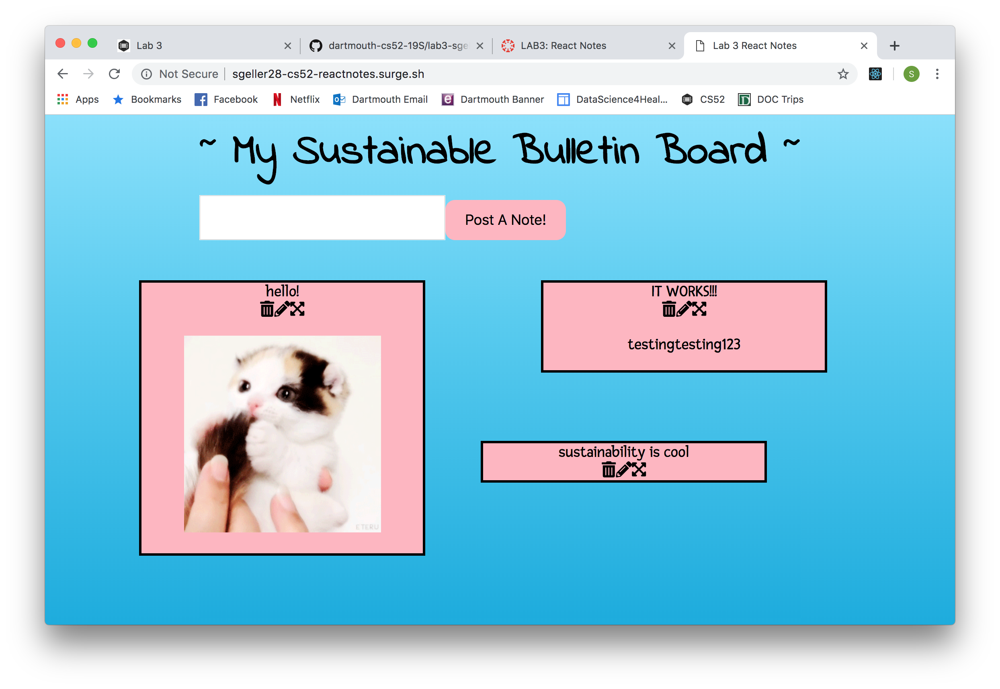

Shoshana Geller, April 22
Lab 3 React Notes - CS52

Welcome to my React Notes site! You can access it from this link: 
http://sgeller28-cs52-reactnotes.surge.sh/.
Using React, Immutable Maps, and Google Firebase, I created a 'notes' app that updates in realtime. Users can add, edit, or delete notes with whatever content they please. They can also drag these notes around the bulletin board. All of these changes will be updated in realtime, and users on different windows will be able to see those changes reflected in realtime.

